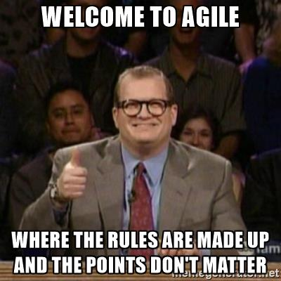

name: abstract
exclude: true

\#NoEstimates is one of the hottest debate in Agile right now, but what is it really? Does it really mean “don’t estimate”, or is it something else entirely? Find out why #NoEstimates is really all about Lean Estimation, as well as how you can ditch the story points, reduce waste in your process, and still generate accurate estimates for the decision makers at your company.

In this talk we’ll discuss ways to improve your estimation process by using historic data to accurately (but perhaps not precisely) forecast into the future. We’ll also cover some commonly used Lean forecasting terms like Lead Time, Cycle Time, and Waste and how they apply to software development estimation as well as some caveats and pitfalls to the Lean Estimation approach.

Tired of bickering over story points and want to make your planning meetings productive again? Join me for this session to learn how we did it.

---

class: center, middle

# \#NoEstimates or \#LeanEstimates
## That is the Question

???
- This is my first time presenting like this, so let's talk about something really controversial.
- Todd Little has a talk called "To Estimate or #NoEstimates, that is the question".
I had seen the talk before coming up with this title, but it was unintentional.
Maybe a Freudian slip but not a concious decision.
- I originally was going to call this Refactor.Rename(NE -> LE).
---

class: center, middle

# Who is this idiot?

???
- Nobody. 
  - Just a software developer here in central OH.
  - Unlike a lot of folks talking about NE, I've nothing to sell.
  - "We are uncovering better ways of developing
software by doing it and *helping others do it*."
- Worked on a (nearly) no estimates project.
- Worked on a team who used the Lean Estimation techniques we'll talk about. 

---

# Agenda

1. \#NoEstimates
2. Lean Estimates
3. Techniques

---

class: center, middle

# \#NoEstimates

---

layout:true

# \#NoEstimates

---

## What is it?
--

> \#NoEstimates is a hashtag for the topic of exploring alternatives to estimates [of time, effort, cost] for making decisions in software development.  That is, ways to make decisions with “No Estimates”. 
> 
> ~ [Woody Zuill](http://zuill.us/WoodyZuill/2013/05/17/the-noestimates-hashtag/)

???
Well, that's not very helpful is it...

More seriously though, NE isn't a methodology, or a practice.
It's a hashtag on twitter. 
It's meant to get us thinking about and questioning how we estimate.

---

## So what is it *really*?
--

- A handful of people actually are actually working without estimates
???
- Woody Zuill, Tim Ottinger
- Nearly No Estimates Research Project
  - Prioritized backlog
  - Just do the next most important thing
  - Continuous flow
  - In some ways it was good, but in other ways stressful. 
    - We had a variable scope, but a hard deadline.
- A common NE model for contractors is to have a client that pays by the iteration.
  - CorgiBytes/Woody Zuill
--

- But most people are talking about *forecasting*.
???
- Todd Little, Troy Magennis, Vasco Duarte
- I've done this too.
  - Prioritized backlog
  - Continuous flow
  - Bi-weekly cadance to replenish backlog
  - Probably didn't need to, but the team like setting (and accomplishing) goals.
---

## What's Wrong with Story Points?
???
- We'll skip over hourly estimations, Agile practioners can generally agree they're unreliable and a source of dysfunction.
--

.center[]

---

## What's Wrong with Story Points?

- Inevitably tied back to time.
???
How many folks in the room have had an extremely hard time getting someone in management or another developer to stop mapping a certain number of points to a certain amount of time?
- 1pt = 1/2 day
- 3pts = 3 days
- etc.
--

- Unreliable
???
- It's only anecdotal, but my team found they were a completely unreliable way of gauging how much work we could do in an iteration.
- Some teams may have success with them, but my team certainly didn't.
--

- Cause of developer friction
???
- How many times have you heard people arguing over whether something was a 3 or 5?
  - Does it really matter?
- See: Inevitably tied back to time.
---

## What's Wrong with #NoEstimates?

### Say what you mean and mean what you say.

---

layout:false
class: center, middle

# Lean Estimates

---

layout:true

# Lean Estimates

---

## Good enough estimates as inexpensively as possible.

---

## In other words, eliminate the waste in your estimation process.

---

### Okay, *maybe* so we're talking about Forecasting...

---

## Lean Terminology
## Techniques
### Short Term Estimation
### Long Term Estimation

---

## Assumptions

- It's safe to be wrong.
???
- Because you will be... but you'll be good enough on average.
  - "All estimates are wrong. Some are useful."
--

- Work is sliced vertically, thinly, and reasonably consistently. 
???
- Stories are small enough to finish in < 1 wk, preferably < 3 days
- Big lumps of work will throw your estimates off.
- "Mixed nuts are fine, but look out for coconuts"
TODO: find the reference for that quote.
--

- Deliver as soon as it's done, not on a sprint boundary.
???
- Waiting to deliver drags your cycle times down.
- If you *must* deliver on a boundry, adjust your cycle time to "ready", but really just deliver when it's ready.
--

- You have control over your process.
???
- This will be hard to do if you're forced into working with Scrumfall or even inside a larger system like SAFe.

[//]: # (Maybe moved assumptions & benefits up a bit.)

---

## Benefits

- Nearly zero time spent estimating. 
--

  - One time investment into a worksheet.
--

  - Minimal tracking overhead, none if using a work tracker like Jira or VSTS.
--

- Less friction.
--

  - No arguing or negotiating estimates.
--

- Business people think in numbers. 
--

  - Giving them estimates based on data builds trust.

---

## References & Resources

[//]: # (Link to this slide deck online)
