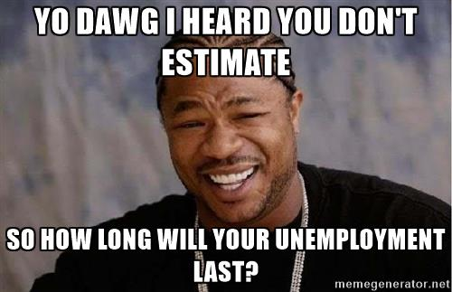
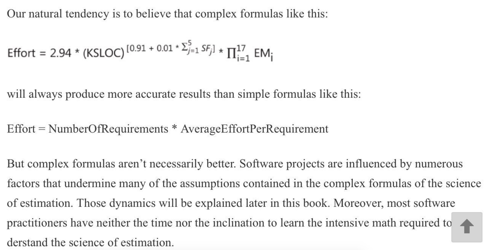

name: abstract
exclude: true

\#NoEstimates is one of the hottest debate in Agile right now, but what is it really? Does it really mean “don’t estimate”, or is it something else entirely? Find out why \#NoEstimates is really all about Lean Estimation, as well as how you can ditch the story points, reduce waste in your process, and still generate accurate estimates for the decision makers at your company.

In this talk we’ll discuss ways to improve your estimation process by using historic data to accurately (but perhaps not precisely) forecast into the future. We’ll also cover some commonly used Lean forecasting terms like Lead Time, Cycle Time, and Waste and how they apply to software development estimation as well as some caveats and pitfalls to the Lean Estimation approach.

Tired of bickering over story points and want to make your planning meetings productive again? Join me for this session to learn how we did it.

---

name: title
class: center, middle

# \#NoEstimates or \#LeanEstimates?
## That is the Question

???
- Who am I?
  - Nobody. 
    - Just a software developer here in central OH.
    - Unlike a lot of folks talking about NE, I've nothing to sell.
    - "We are uncovering better ways of developing
  software by doing it and *helping others do it*."
  - Worked on a (nearly) no estimates project.
  - Worked on a team who used the Lean Estimation techniques we'll talk about. 
- Todd Little has a talk called "To Estimate or #NoEstimates, that is the question".
I had seen the talk before coming up with this title, but it was unintentional.
Maybe a Freudian slip but not a concious decision.
  - I originally was going to call this Refactor.Rename(NE -> LE).
- This is my first time presenting like this, so let's talk about something really controversial.

---

class: center, middle

# \#NoEstimates

---

layout:true
class: center

# \#NoEstimates

---

## What is it?
--

> \#NoEstimates is a hashtag for the topic of exploring alternatives to estimates [of time, effort, cost] for making decisions in software development.  That is, ways to make decisions with “No Estimates”. 
> 
> ~ [Woody Zuill](http://zuill.us/WoodyZuill/2013/05/17/the-noestimates-hashtag/)

???
Well, that's not very helpful is it...

More seriously though, NE isn't a methodology, or a practice.
It's a hashtag on twitter. 
It's meant to get us thinking about and questioning how we estimate.

---

## So what is it *really*?
--

### A handful of people actually are actually working without estimates
???
- Woody Zuill
- A common NE model for contractors is to have a client that pays by the iteration.
  - CorgiBytes/Woody Zuill
- Delivering so frequently and building so much trust that estimates aren't required.
- Nearly No Estimates Research Project
  - Prioritized backlog
  - Just do the next most important thing
  - Continuous flow
  - In some ways it was good, but in other ways stressful. 
    - We had a variable scope, but a hard deadline.
--

### But most people are talking about *forecasting*.
???
- Todd Little, Troy Magennis, Vasco Duarte
- I've done this too.
  - Prioritized backlog
  - Continuous flow
  - Bi-weekly cadance to replenish backlog
  - Probably didn't need to, but the team like setting (and accomplishing) goals.

---

layout: true
class: center

# \#NoEstimates
## What's Wrong with Story Points?

---

???
- We'll skip over hourly estimations, Agile practioners can generally agree they're unreliable and a source of dysfunction.
- But story points were created to solve issues with task level, hourly estimates, so what's wrong with them?

---

### Confusing & Inevitably tied back to time.

> Newbies are confused and uncomfortable estimating with story points and frequently compensate by consistently translating story points back to actual time estimates.
>
> ~ [Joshua Kerievsky - Stop Using Story Points](https://www.industriallogic.com/blog/stop-using-story-points/)

???
How many folks in the room have had an extremely hard time getting someone in management or another developer to stop mapping a certain number of points to a certain amount of time?
- 1pt = 1/2 day
- 3pts = 3 days
- etc.

---

### Easily Abused & Gamed

> I shook my head, amazed at how a mature agile team, a team that had been assessed, trained and coached by myself and two excellent Industrial Logic coaches, could so suddenly inflate their story point estimates to appear like they were going faster.
> 
> ~ [Joshua Kerievsky - Stop Using Story Points](https://www.industriallogic.com/blog/stop-using-story-points/)

---

### Unreliable
???
- It's only anecdotal, but my team found they were a completely unreliable way of gauging how much work we could do in an iteration.
- Some teams may have success with them, but my team certainly didn't.

---

### Cause of developer friction
???
- How many times have you heard people arguing over whether something was a 3 or 5?
  - Does it really matter?
- See: Inevitably tied back to time.

---

### More often than not, they're *guesses*.

> Count if at all possible.
> 
> Compute when you can’t count.   
>
> ***Use judgment alone only as a last resort.***
> 
> ~ [Steve McConnell - *Software Estimation: Demystifying the Black Art*](http://www.stevemcconnell.com/est.htm)

???
Educated guesses maybe, but guesses none the less.
People are *really* bad at estimation.

How many folks in the room are actually doing relative size estimation?
How many are playing planning poker and going "ehhh... that looks like a 5"?

McConnell wrote this book in 2006. 
That was a decade ago.

---

---

layout: true
class: center

# \#NoEstimates
## What's Wrong with \#NoEstimates?

???
\#NoEstimates was created in an effort to try to solve these issues with story points.

---

### Should we do this project?
--

### How do you know without an estimate? 
???
Both cost & value
- What if you have two projects? How do you decide which one to do?
---

### What would happen if you told your manager/client that you're not going to estimate?

---

???
Maybe a little dramatic, but you are likely to be laughed at.
And if you say "We don't estimate, we *forecast*.", I *guarantee* you're going to get some strange looks.
Forecast implements Estimate. 

---

### Forecasts are a kind of estimate
--

> ***Say what you mean and mean what you say.***
> 
> ***Let your words and actions match.***

???
Developers, if there was a method or a class in your codebase and it had a misleading name, what woud you do?
You'd *rename* it, wouldn't you?

It is *terribly* important that we communicate clearly with the folks who sign the checks.
Most of the people talking about \#NoEstimates are talking about forecasting, so why are we continuing to use the word "No" when we don't mean it?

---

layout:false
class: center, middle

# Lean Estimates

---

layout:true
class: center

# Lean Estimates

---

## Terminology

### Waste
### Throughput
### Cycle Time
### Lead Time

???
- Waste
  - Non value add activites.
  - If a customer won't buy it, or it doesn't directly produce something a customer will buy, it's waste.
- Throughput
  - The number of widgets that can be produced in X amount of time.
- Cycle Time
  - How long it takes to make a widget.
- Lead Time
  - The amount of time between a customer ordering a widget, and them recieving the widget.

---

## What are Lean Estimates?
--

### Good enough estimates as inexpensively as possible.
--

### In other words, eliminate the waste in your estimation process.

???
- In a recent conversation I was having with Ryan Ripley, he described it as the
"Cheapest estimate/metric/process that meets the needs of the customer."
  - https://twitter.com/ryanripley/status/851914164754927617

- Next -> Characteristics of Lean Estimates
---

### If you don't need to estimate, don't.
--

### If you must, do it as inexpensively as possible and just in time.
--

### Empirical and data driven.

---

layout:true
class: center

# Lean Estimates
## Techniques

---

~ [Steve McConnell - *Software Estimation: Demystifying the Black Art*](http://www.stevemcconnell.com/est.htm)

---

### Short Term 

---

### Measure Throughput
--

### i.e Count Stories Completed

???

- Card/Story counting
- Challenge audience to run an experiment: 
  - Count and story point for a while. Decide for yourselves.

---

### Little's Law

> The long-term average number of customers in a stable system L is equal to the long-term average effective arrival rate, λ, multiplied by the average time a customer spends in the system, W; or expressed algebraically: L = λW

---

### Little's Law

In English....

> Avg. Cycle Time = ( Avg. Work in Progress / Avg. Throughput )

???
We can check it.

---

### Little's Law

> Cycle Time = ( WIP / Throughput )
>
> WIP = CycleTime * Throughput
> 
> Throughput = ( WIP / Cycle Time )

---

### Little's Law Applied

> AVg. Throughput per Iteration = ( WIP / Cycle Time ) * Days per Iteration
--

> 
> T = ( 2 stories /  3 days ) * ( 10 days / iteration )
--

> 
> T = ( 0.6666 stories / day ) * ( 10 days / iteration )
--

> 
> T = 6.666 stories / iteration

---

### Little's Law Applied (The hard way.)

> Avg. Stories per Iteration = ( Days per Iteration / Avg. Cycle Time ) * Avg. WIP

???
This should be very close to your Avg. Throughput
--

> 
> Avg. Stories per Iteration = 
> ( (10 days / iteration) / ( 3 days / story ) ) * 2 in progress
--

>
> Avg. Stories per Iteration = 3.333 stories * 2 in progress = 6.666 stories / iteration

---
layout:true
class: center

# Lean Estimates
## Techniques
### Long Term 

---

Effort = Number of Stories * Avg. Effort per Story

---

???
Caveat & Warning
I've never been able to compare the long term technique to actuals. Once people saw how expensive it would be, they decided to either buy something off the shelf or simply spend their money elsewhere.

---

## Assumptions

- It's safe to be wrong.
???
- Because you will be... but you'll be good enough on average.
  - "All estimates are wrong. Some are useful."
--

- Work is sliced vertically, thinly, and reasonably consistently. 
???
- Stories are small enough to finish in < 1 wk, preferably < 3 days
- Big lumps of work will throw your estimates off.
- ["Mixed nuts are fine, but look out for coconuts"](http://toddlittleweb.com/wordpress/2016/03/14/to-estimate-or-noestimates-that-is-the-question-2/)
--

- Deliver as soon as it's done, not on a sprint boundary.
???
- Waiting to deliver drags your cycle times down.
- If you *must* deliver on a boundry, adjust your cycle time to "ready", but really just deliver when it's ready.
--

- You have control over your process.
???
- This will be hard to do if you're forced into working with Scrumfall or even inside a larger system like SAFe.
--

- You have *good* and *tested* code.
???
If you have crap code, you'll have crap predictability.

[//]: # (Maybe moved assumptions & benefits up a bit.)

---

## Benefits

- Nearly zero time spent estimating. 
--

  - One time investment into a worksheet.
--

  - Minimal tracking overhead, none if using a work tracker like Jira or VSTS.
--

- Less friction.
--

  - No arguing or negotiating estimates.
--

- Business people think in numbers. 
--

  - Giving them estimates based on data builds trust.

---

## References & Resources

[//]: # (Link to this slide deck online)
