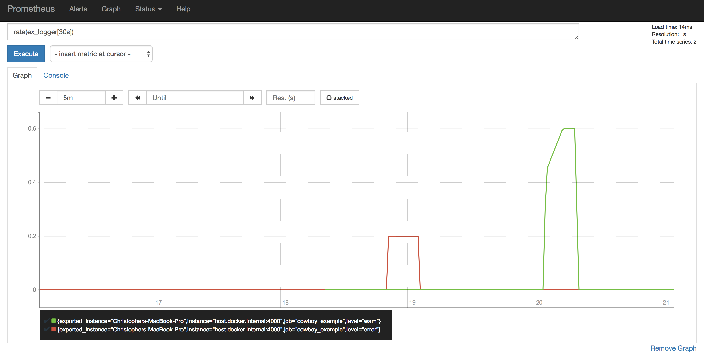

name: template
layout: true

{{content}}

.footnote[
[Columbus Elixir](https://www.columbuselixir.com/) 2019-09-03 @rubberduck203 [theupsyde.net](https://theupsyde.net)
]
---

name: title
class: center, middle

# Implementing a Custom Elixir Logger

---

class: left
# Agenda

## * Who am I?
## * Motivation
## * Logger
## * ex_prometheus_logger demo

???
I'll quickly introduce myself and  
explain what motivated me to write a custom logger backend.
The we'll actually get into what it takes to implement a logger, 
and finally we'll wrap up with a demonstration of my Prometheus logger.

---

class: center
# Who Am I?

???
Nobody.
Think for yourselves.
--

## Chris McClellan (@Rubberduck203)
--

### Decade-ish in software
--

### Polyglot Generalist
--

#### Embedded, Web, Desktop, Big Data
--

### Former Smart Columbus OS Developer

???
I'm not an Elixir expert, so if something in my implementation looks off or unidiomatic, it probably is.
---

class: center, middle
# Motivation
---

class: center
# Motivation

## OTP is Good at Restarting Processes
--

### Too Good

???
BEAM and OTP are great, but they're almost too resilient.  
How many folks in the room have pushed a change,  
only to realize later that a child process was just constantly failing and restarting?
--

### Need Real-Time Visibility into Number of Errors
---

class: center
# Solution

## Count the number of warnings and errors and expose them to our monitoring solution, Prometheus

???
Prometheus is a monitoring system and time series database.  
The team was already using Prometheus for monitoring and analytics,  
so it made sense to find a way to get this data into the system  
so we could create a dashboard or alerts.

---
class: middle



???
This is the end goal.  
We want to be able to see (and alert on!) a large number of errors occuring in our system.  
---

# Logger

### Event driven, powered by `:gen_event`

```elixir
init(args :: term) :: {:ok, state} # | ...
handle_event(event :: term, state :: term) :: {:ok, new_state} # | ...
handle_call(request :: term, state :: term) :: {:ok, reply, new_state} # | ... 
handle_info(msg :: term, state :: term) :: {:ok, new_state} # | ...
terminate(reason, state :: term) :: term
code_change(old_vsn, state :: term, extra :: term) :: {:ok, new_state :: term}
```

???
A basic implementation only has to implement `init`, `handle_event`, and `handle_call`
---

# Logger

`handle_event` format

```elixir
{level, group_leader, {Logger, message, timestamp, metadata}} | :flush
```
--

When `Logger` is called, the `handle_event` function is invoked.
- `level`: log level
- `group_leader`: group leader of the process which logged the message
- `Logger`: atom
- `message`: logged text
- `timestamp`: `{{year, month, day}, {hour, minute, second, millisecond}}`
- `metadata`: keyword list of metadata used when logging the message

--

In the case of the event `:flush` handlers should flush any pending data.

???
It is recommended that handlers ignore messages where the group leader is in a different node than the one where the handler is installed.

We won't use all of these fields in our Prometheus implementation, but you probably would use them in a traditional logger implementation.
---

# init

```elixir
  @name :ex_logger

  def init(_args) do
    Counter.declare(
      name: @name,
      help: "Logged message count by level.",
      labels: [:instance, :level]
    )

    backend_env = Application.get_env(:logger, __MODULE__, [level: :warn])
    {:ok, backend_env}
  end
```

???
- Initialize the Prometheus counter
- Retrieve the logger configuration, defaulting to `:warn` if it doesn't exist.

---

# handle_event

```elixir
def handle_event({level, _group_leader, {Logger, _message, _timestamp, _metadata}}, state) do
  case Logger.compare_levels(level, Keyword.get(state, :level)) do
    :lt -> nil
    _ -> Counter.inc(name: @name, labels: [hostname(), level])
  end

  {:ok, state}
end

def handle_event(:flush, state) do
  {:ok, state}
end
```

???
- `Logger.compare` returns `:lt`, `:gt`, or `:eq`
- If the log level is less than our configured log level, do nothing
- Else increment the counter
- Because Prometheus works on a scraping model, instead of pushing, there are no messages to flush.
---

# handle_call

```elixir
def handle_call({:configure, options}, state) do
  {:ok, :ok, Keyword.merge(state, options)}
end
```
--

You can change `Logger`'s configuration at runtime.  

https://christopherjmcclellan.wordpress.com/2018/06/02/how-to-change-elixir-log-levels-for-a-running-application/

???
Here we just merge the current configuration with the new configuration.  
This is necessary to enable updating configuration at runtime.  
Handy for keeping logs quiet in prod, until we need to get more information to debug something.
---

class: center, middle
# That's It!

???
The full Prometheus backend is less than 50 lines of code!
---

# Register the Backend
## config.exs

```elixir
config :logger,
  backends: [:console, Logger.Backends.Prometheus]

config :logger, Logger.Backends.Prometheus,
  level: :info
```
---

class: center, middle
# DEMO

???
```sh
cd ~/src/ex_prometheus_logger/example
docker-compose up -d
open http://localhost:9090

cd cowboy
mix deps.get
iex -S mix
```

```console
require Logger
Logger.warn "uh oh"
Logger.error "boom"
```

```promql
rate(ex_logger[1m])
```

Note that the `console` logger is still working too!
---

class: center
# Closing Thoughts
--

## Implementing your own logger is extremely easy
--

## Event driven patterns make it easy to change/add implementations
--

## How might you leverage `:gen_event` in your own designs?

---
# Resources:
#### * https://hexdocs.pm/logger/Logger.html#module-custom-backends
#### * https://github.com/rubberduck203/ex_prometheus_logger
#### * https://github.com/elixir-lang/elixir/blob/master/lib/logger/lib/logger/backends/console.ex
#### * https://hexdocs.pm/elixir/GenEvent.html
#### * http://erlang.org/doc/man/gen_event.html
---

class: center, middle
# THANKS!

## https://theupsyde.net/presentations/elixirlogger
## Twitter: @rubberduck203